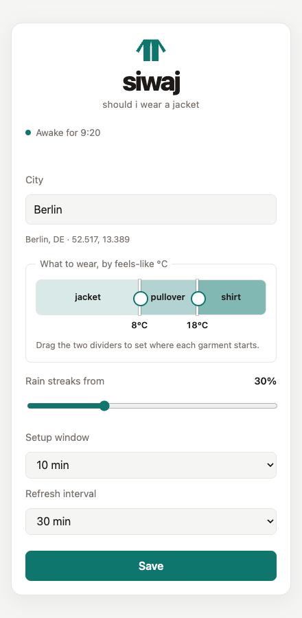

<h1 align="center">siwaj</h1>

<p align="center">
  <em>Should i wear a jacket? This little e-paper sign answers before you go outside and find out it was too cold or too hot.</em>
</p>

<p align="center">
  
  
</p>

> [!NOTE]
> Most of the code here was generated by GLM 5.3.

siwaj runs on a Waveshare ESP32-S3-ePaper-1.54 (V2) board with a 200x200 e-ink display. It wakes on the interval you set, asks [OpenWeather](https://openweathermap.org/) how it feels outside, draws one of three garments (jacket, pullover or shirt) with a rain warning, and sleeps again with the radio off.

When unconfigured, it brings up its own wifi network and serves the setup page above. You enter a city and drag two handles to set where jacket becomes pullover, and where pullover becomes shirt.

## What you need

| Part | Notes |
| --- | --- |
| Waveshare ESP32-S3-ePaper-1.54 (V2) | 200x200 e-ink panel, 8MB flash, ships with the case |
| 3.7V LiPo with an MX1.25 plug | Sold as MX1.25, Molex PicoBlade, or "JST 1.25". JST-PH 2.0 and JST-GH 1.25 look close and do not mate. A 40 x 20 x 6 mm cell fits the case |
| USB-C cable that carries data | A charge-only cable powers the board and enumerates nothing, which looks exactly like dead hardware |

The board runs from USB alone, so the cell is only needed once the sign hangs on a wall.

You also need an [OpenWeather API key](https://home.openweathermap.org/api_keys) and the Rust esp toolchain ([espup](https://github.com/esp-rs/espup)).

> [!IMPORTANT]
> The key needs the [One Call by Call](https://openweathermap.org/full-price#current) subscription, which you activate at [openweathermap.org/price](https://openweathermap.org/price). The first 1000 calls a day are free, but OpenWeather asks for a card before it turns the plan on. Each wake spends two calls, so a fifteen minute refresh runs at about 200 a day.

## Burn it

Install the toolchain and dependencies:

```
make install
```

Copy `.env.example` to `.env` and fill in all three values. The wifi has to be 2.4GHz, since the ESP32-S3 has no 5GHz radio:

```
OPENWEATHER_API_KEY=...
WIFI_SSID=...
WIFI_PASS=...
```

Plug the board in over USB, then push the secrets into it and flash:

```
make provision       # writes the secrets to encrypted storage over serial
make firmware-flash  # builds, flashes, opens the serial console
```

The console prints the device address once wifi connects. Open it, set your city, and save. Hold BOOT while the board powers on to reach the setup page again.

## Emulator

The firmware runs under QEMU with no board attached, setup page included:

```
make qemu-run        # emulated firmware, setup page on http://127.0.0.1:47652
make qemu-display    # live window showing the emulated e-paper face
make demo            # the e-paper frames, offline sample data
```

`make help` lists the rest.
