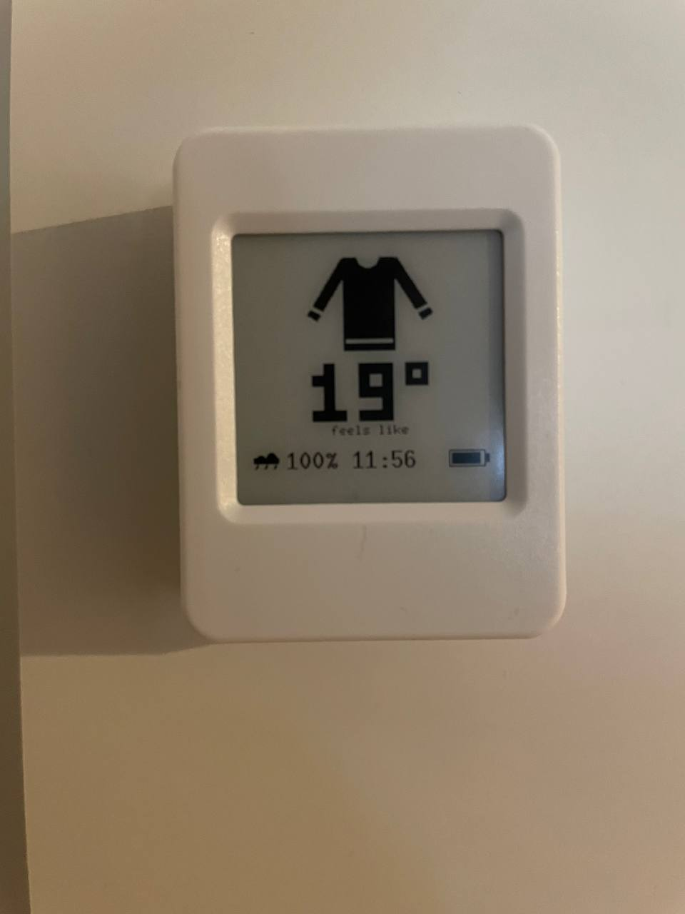

<h1 align="center">siwaj</h1>

<p align="center">
  <em>Should i wear a jacket? This little e-paper sign answers before you finish asking.</em>
</p>

<p align="center">
  
</p>

> [!NOTE]
> Most of the code here was generated by GLM 5.3.

It is a Waveshare ESP32-S3-ePaper-1.54 (V2) board with a 200x200 e-ink display. It sleeps in a drawer, wakes on whatever interval you pick, asks OpenWeather how it feels outside, and draws one of three garments (jacket, pullover, shirt) plus a rain warning. Then it goes back to sleep with the radio off, which is the only reason a battery this small is worth trying.

If nobody has configured it yet, it puts up its own wifi network and serves a config page. Type your city, drag the two handles to say where jacket becomes pullover becomes shirt, done.

The name is short for "should i wear a jacket". The README is mostly the name.

## Burn it

You need the board above, an OpenWeather key and the Rust esp toolchain ([espup](https://github.com/esp-rs/espup)).

> [!IMPORTANT]
> The key has to be subscribed to "One Call by Call". The first 1000 calls a day cost nothing, but OpenWeather wants a card on the account before it will activate. Each wake spends two calls, so a fifteen minute refresh runs at about 200 a day.

```
make install
```

Put your secrets in `.env` (`OPENWEATHER_API_KEY=...`, `WIFI_SSID=...`, `WIFI_PASS=...`) and plug the board in over USB:

```
make provision       # push secrets into the device's encrypted storage
make firmware-flash  # build, flash, drop into the serial console
```

The console prints the device's address once wifi connects. Open it, set your city, and let it live somewhere you dress in front of. Hold BOOT while it powers on to get the config page back.

## No device yet?

The whole device runs emulated, config page included:

```
make qemu-run        # emulated device on http://127.0.0.1:47652
make qemu-display    # live window with the emulated e-paper face
make demo            # the e-paper frames, offline sample data
```

`make help` lists the rest.
